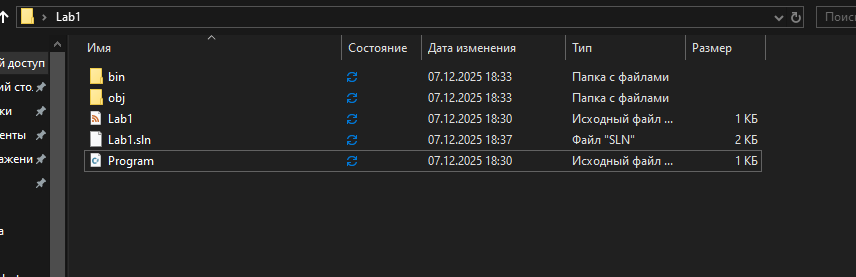
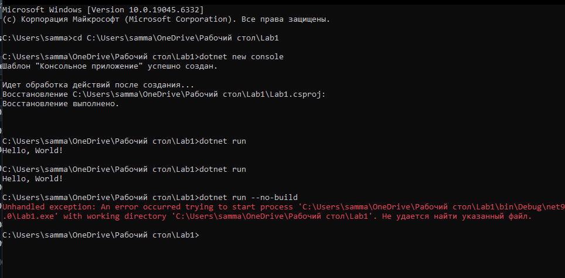
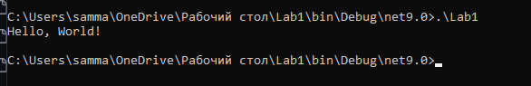
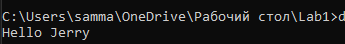

# DESIGN2
Изначально, ничего не удаляя, папка выглядела следующим образом:

Потом я удалил папки bin и obj и у меня выдало следующую ошибку

Команда выдала ошибку потому что нету готового файла, поэтому dotnet run --no-build не находит что запускать и выдаёт ошибку.

Потом я воссоздал файл обратно.

Далее я запустил выполняемый файл и открыл его через консоль

Затем я напечатал Hello Jerry в консоль

Затем я написал функцию, которая ABC и выполняется 3 раза с задержкой в 0,5 секунды, а также сразу сделал 3 функции  (A, B, C). Вызвал функции B и C в функции A. Также вызвал функцию A в основной программе несколько раз.

# Что будет, если функцию нигде не вызвать?

Функция скомпилируется, то есть компилятор её «знает». Но выполняться она не будет никогда, если её не вызвать.

# Важен ли порядок определения функций? Возможно ли сослаться из функции, определенной раньше в файле, к функции, определенной после? Попытайтесь это сделать.

Не важен, так как компилятор видит весь файл целиком.

